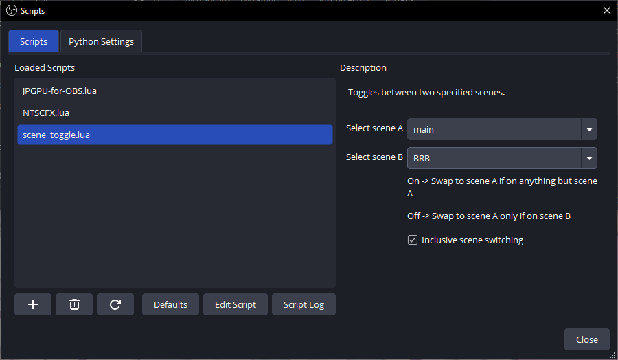

## How to use
1. Load script via the Tools->Scripts menu
2. Set which scenes you wish to toggle between in the settings menu
3. Assign a hotkey to the scene toggle in File->Settings->Hotkeys->Filter for "Toggle Scenes Hotkey"
